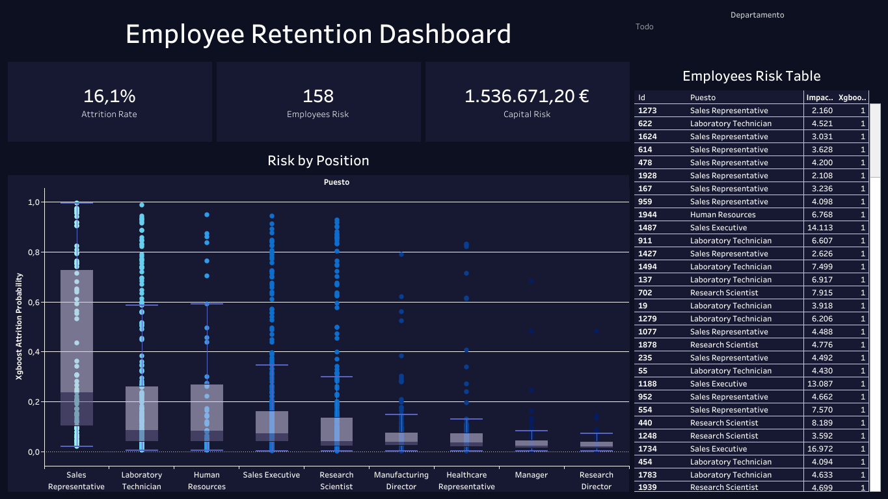

# Employee Attrition Analysis

This project utilizes data analysis techniques and machine learning models to study the employee attrition rate in an organization. An exploratory data analysis is performed, important relationships between variables are visualized, and predictive models are built to estimate the economic impact of employee turnover.

## Dashboard

For an interactive overview of the analysis and results, please visit the dashboard created with Tableau: [Employee Retention Dashboard](https://public.tableau.com/views/EmployeeRetention_17295475897190/Dashboard1?:language=es-ES&publish=yes&:sid=&:redirect=auth&:display_count=n&:origin=viz_share_link).



## Project Description

1. **Data Loading and Cleaning:**
   - The dataset `Employee_Attrition.csv` is loaded, and transformations are performed to clean missing data and remove irrelevant columns.

2. **Exploratory Data Analysis (EDA):**
   - Visualizations are created to study the distributions of categorical and numerical variables. 
   - A correlation analysis is conducted between the variables and the attrition rate.

3. **Machine Learning Models:**
   - A decision tree is trained to predict the probability of employee attrition. 
   - Multiple models such as Decision Tree, Random Forest, XGBoost, and Logistic Regression are compared.
   - Evaluation metrics: ROC AUC, accuracy, recall, F1 Score, and confusion matrix.

4. **Calculation of the Impact of Turnover:**
   - The economic costs of employee turnover are estimated by salary level and commitment, and potential savings are calculated by reducing turnover by 10%, 20%, and 30%.

## Dependencies

- Python 3.x
- Required libraries:
  - numpy
  - pandas
  - scikit-learn
  - seaborn
  - matplotlib
  - xgboost

Install all dependencies using:

```bash
pip install -r requirements.txt
```

## Expected Results

1. **Clone the repository:**

- Visualizations of data distributions and correlations.
- Predictions of attrition with different models.
- Detailed evaluations of accuracy and costs.

## Contact
For any questions or suggestions, please contact daniel272aguilar@gmail.com.